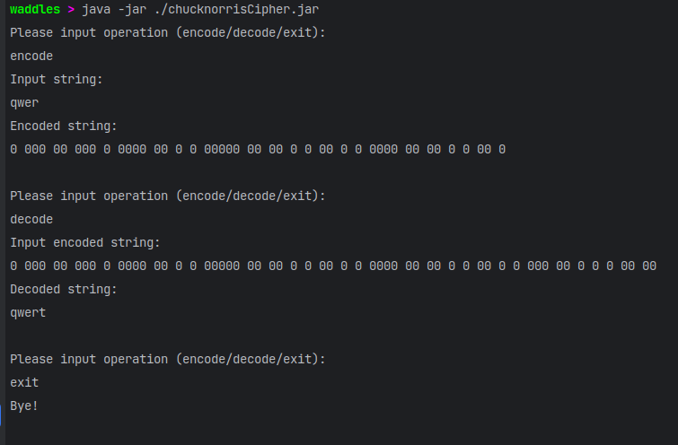

# Chuck_Norris_Cipher_Encoder
Little project with console menu

### Example



### Build source
```shell
javac --source-path src/ -d bin src/chucknorris/Main.java
```

### Run
```shell
java --class-path ./bin chucknorris.Main
```

### Create jar
```shell
javac --source-path src/ -d bin src/chucknorris/Main.java
jar cefv chucknorris.Main  chucknorrisCipher.jar -C ./bin .
```

### Run jar
```shell
java -jar ./chucknorrisCipher.jar
```